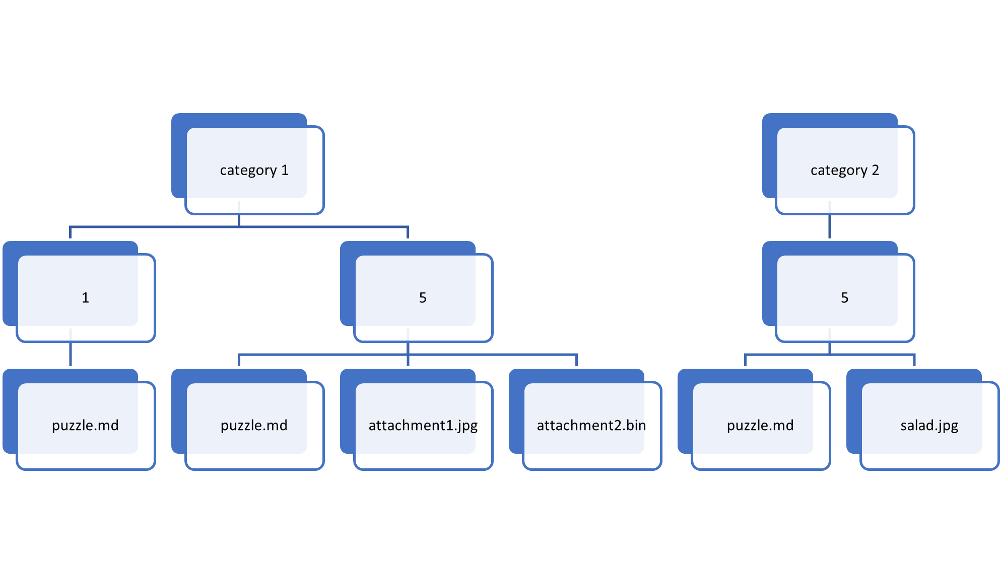

Developing Content: Structure
================



MOTH content heirarchy consists of three layers:
categories, puzzles, and attachments.

Category
-------

A category consists of one or more puzzles.
Each puzzle is named by its point value,
and each point value must be unique.
For instance,
you cannot have two 5-point puzzles in a category.

Scoring is usually calculated by summing the 
*percentage of available points per category*.
This allows content developers to focus only on point values within a single category:
how points are assigned in other categories doesn't matter.

Puzzle
-----

A puzzle consists of a few static fields,
a main puzzle body,
and optionally attached files.

At a minimum,
a puzzle must contain `puzzle.md`:
a 
[CommonMark Markdown](https://spec.commonmark.org/dingus/)
file with metadata.

Example:

```markdown
---
authors:
  - Neale Pickett
answers:
  - one of its legs are both the same
  - One of its legs are both the same
  - one of its legs are both the same.
  - One of its legs are both the same.
---

This puzzle consists of a joke.

What is the difference between a duck?
```

### Puzzle Metadata

Puzzle metadata is the section of `puzzle.md` between `---`.
This section consists of [YAML](https://yaml.org/),
describing various metadata aspects of the puzzle.

At a minimum,
each puzzle should contain:

* authors: who created the puzzle
* answers: a list of answers that are considered "correct"

Other metadata a puzzle can contain:

* debug: information used only in development mode
  * summary: text summarizing what this puzzle is about
  * notes: any additional notes you think it's important to record
  * hints: a list of hints that could aid an instructor
* objective: what the goal of this puzzle is
* ksas: a list of NICE KSAs covered by this puzzle
* success: criteria for success
  * acceptable: criterion for acceptably succeeding at the task
  * mastery: criterion for mastery of the task
* attachments: a list of files to attach to this puzzle (see below)

### Body

The body of a puzzle is interpreted as
[CommonMark Markdown](https://spec.commonmark.org/dingus/)
and rendered as HTML.

Attachments
-------

Any filenames listed under `attachments` in the metadata will be included
with the puzzle.

Usually,
these are listed at the bottom of each puzzle,
one by one.
But you can also refer to attachments from the puzzle body
with either links or inline images.

```markdown
This is a [link](attachment-document.html).
And this is an inline image: 
```


Developing Content: Source vs Mothballs
=============================

As a developer,
you will begin by running MOTH in development mode.
In development mode,
MOTH will provide answers for each puzzle alongside the puzzle.

In order to run in production mode,
each category must be "transpiled" into a "mothball".
This is done to reduce the amount of dynamic code running on a production server,
as a way of decreasing the attack surface of the server.

To obtain a mothball,
simply click the "download" button on the puzzles list of a development server.
Mothballs have the file extension `.mb`.


Setting Up Your Workstation
=====================

You will need two things to develop content:
a MOTH server,
and a text editor.

MOTH Server
-----------

### Windows

Windows users can unzip the zip file provided by the MOTH development team,
and run `moth-devel.bat`.
You can close this window whenever you're done developing.

Once started,
open
http://localhost:8080/
to connect to your development server.

### Linux

Linux users with Docker can run the following to get started

```sh
mkdir -p puzzles
docker run --rm -it -p 8080:8080 -v $(pwd)/puzzles:/puzzles:ro ghcr.io/dirtbags/moth-devel
```

Hit Control-C to terminate MOTH.


Text Editor
---------

We like Visual Studio Code,
but any text editor will work:
you only need to edit the `puzzle.md` (Markdown) files.

Your First Category
================

Open the `puzzles` directory/folder created where you launched the server.
Create a new directory/folder named `test-category`.
Within that directory/folder,
create a directory/folder named `1`.
And within `1`,
create a new file named `puzzle.md`.
Paste the following text into that file:

```markdown
---
authors:
  - YOUR NAME HERE
answers:
  - Elephant
  - elephant
---

# Animal Time

Do you like animals? I do!
Can you guess my favorite animal?
```

Now,
open http://localhost:8080/ in a web browser.
You should see a "test-category" category,
with a single 1-point puzzle.
Click that puzzle,
and you should see your animal puzzle presented.

The two answers we're accepting can be improved,
because some people might use the plural.
Edit `puzzle.md` to add two new answers:
`Elephants` and `elephants`.
Reload the web page,
and check the debug section to verify that all four answers are now accepted.

Next Steps
==========

The [Writing Puzzles](writing-puzzles.md) document
has some tips on how we approach puzzle writing.
There may be something in here that will help you out!

Once your category is set up the way you like it,
download a mothball for it,
and you're ready for [getting started](getting-started.md)
with the production server.
